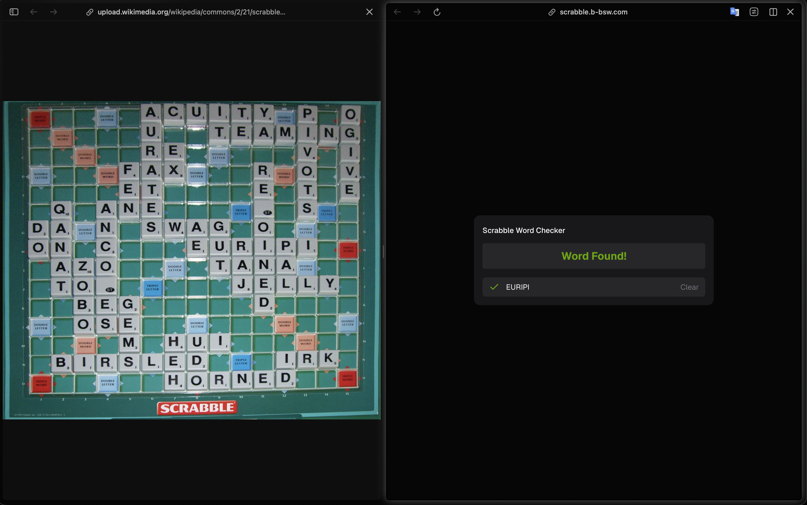

# Scrabble Word Finder

An application to help you find words in a Scrabble game.



## Project Structure

This is a monorepo containing both the frontend and backend applications:

- **`scrabble/`**: The frontend application built with Next.js, React, HeroUI, and Tailwind CSS.
- **`api-scrabble/`**: The backend API built with Express and running on Bun.

## Getting Started

### Using Docker Compose (Recommended)

The easiest way to run the entire application stack is by using Docker Compose.

1. Make sure you have Docker and Docker Compose installed.
2. Run the following command from the root of the project:

```bash
docker-compose up --build
```

The services will be available at:
- **Frontend**: http://localhost:3000
- **Backend API**: http://localhost:8000

---

### Running Manually

If you prefer to run the services locally without Docker, follow these steps:

#### 1. Backend (API)
The backend uses [Bun](https://bun.sh/) as its runtime.

```bash
cd api-scrabble
# Install dependencies
bun install
# Start the server
bun start
```
The API will run on http://localhost:8000.

#### 2. Frontend (Next.js)
The frontend is a Next.js application.

```bash
cd scrabble
# Install dependencies (using bun, npm, pnpm, or yarn)
bun install
# Start the development server
bun run dev
```
The frontend will run on http://localhost:3000.

## Tech Stack

- **Frontend**: Next.js 15+, React 19, Tailwind CSS v4, HeroUI
- **Backend**: Bun, Express
- **Infrastructure**: Docker, Docker Compose
